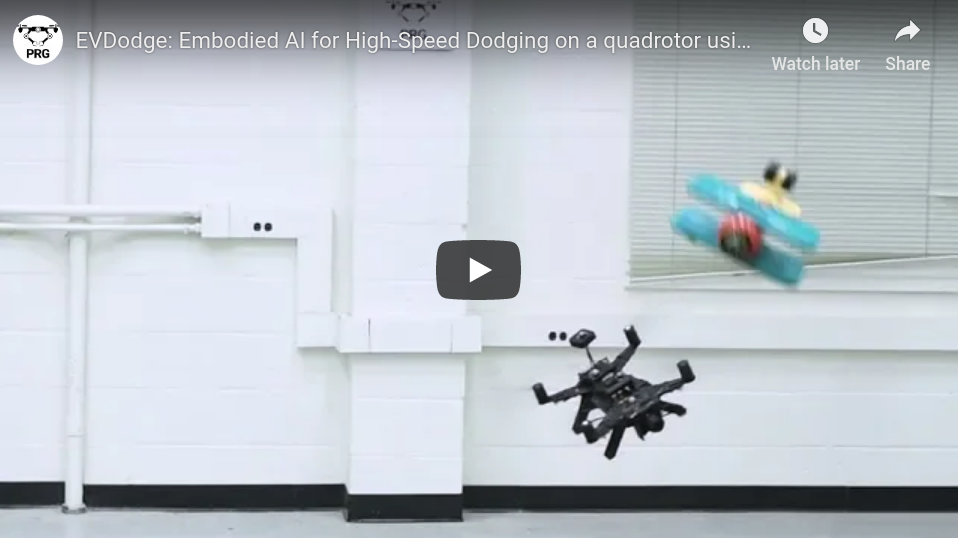

# EVDodge: Embodied AI for High-Speed Dodging on a quadrotor using event cameras
**EVDodge** by <a href="prg.cs.umd.edu"><i>Perception & Robotics Group</i></a> at the Department of Computer Science, <a href="https://umd.edu/">University of Maryland- College Park</a> and <a href="http://rpg.ifi.uzh.ch">Robotics & Perception Group</a> at <a href="https://www.ifi.uzh.ch/en.html">University of Zurich</a>.


### Code and instruction guidelines will be uploaded here on the acceptance of the paper.

###### Check out our Youtube video which depicts the proposed framework of our bio-inspired perceptual design for quadrotors.
[](https://www.youtube.com/watch?v=k1uzsiDI4hM)

In this paper, we develop a purposive artificial intelligence based formulation for the problem of general navigation. We call this AI framework "Embodied AI" - AI design based on the knowledge of agent's hardware limitations and timing/computation constraints. Following this design philosophy we develop a complete AI navigation stack for dodging multiple dynamic obstacles on a quadrotor with a monocular event camera and computation. We also present an approach to directly transfer the shallow neural networks trained in simulation to the real world by subsuming pre-processing using a neural network into the pipeline. 

- Project Page
- Paper
- Supplementary
- arXiv Preprint

## Publication:

```
@inproceedings{Sanket2019EVDodgeEA,
  title={EVDodge: Embodied AI For High-Speed Dodging On A Quadrotor Using Event Cameras},
  author={Nitin J. Sanket and Chethan M. Parameshwara and Chahat Deep Singh and Ashwin V. Kuruttukulam and Cornelia Fermuller and Davide Scaramuzza and Yiannis Aloimonos},
  year={2019}
}
```

## License:
Copyright (c) 2019 Perception and Robotics Group (PRG)
